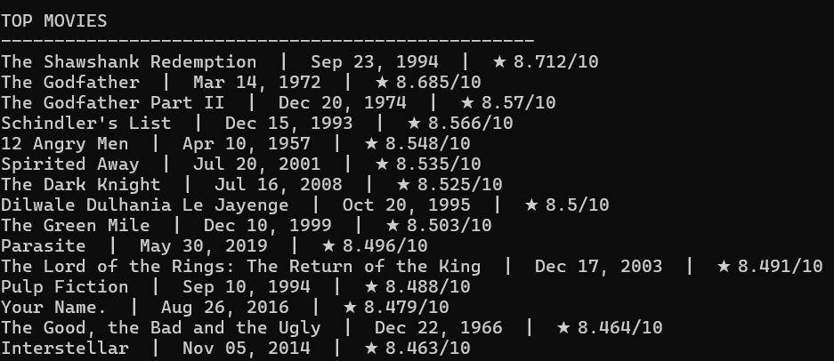

# CineFetch
Tiny command-line tool that shows **now-playing**, **popular**, **top-rated**, or **upcoming** movies using [The Movie Database (TMDB)](https://www.themoviedb.org) API.



## Install & Run (Windows / macOS / Linux)

1. Install **Python 3.9+** from https://www.python.org  
2. Clone / download this repo and open a terminal inside it.

```bash
git clone https://github.com/YOUR_GITHUB/tmdb-cli.git
cd tmdb-cli
python -m venv .venv
```

**Windows**
```cmd
.venv\Scripts\activate
```

**macOS / Linux**
```bash
source .venv/bin/activate
```

```bash
pip install -r requirements.txt
```

3. Get a free TMDB API key  
   - Sign up → https://www.themoviedb.org/settings/api → copy **v3 key**.
4. Create `.env` file (NEVER commit it):

```ini
TMDB_API_KEY=your_real_key_here
```

5. Run:

```bash
python tmdb_app.py --type popular
```

or (Windows wrapper)

```cmd
tmdb-app --type upcoming
```

## Commands

| Option | Description |
|--------|-------------|
| `--type playing`   | Now-playing movies |
| `--type popular`   | Most popular today |
| `--type top`       | Highest rated ever |
| `--type upcoming`  | Future releases |

## Error Handling

Graceful messages for network failures or missing API key.

## Author

FrenchFries

```
